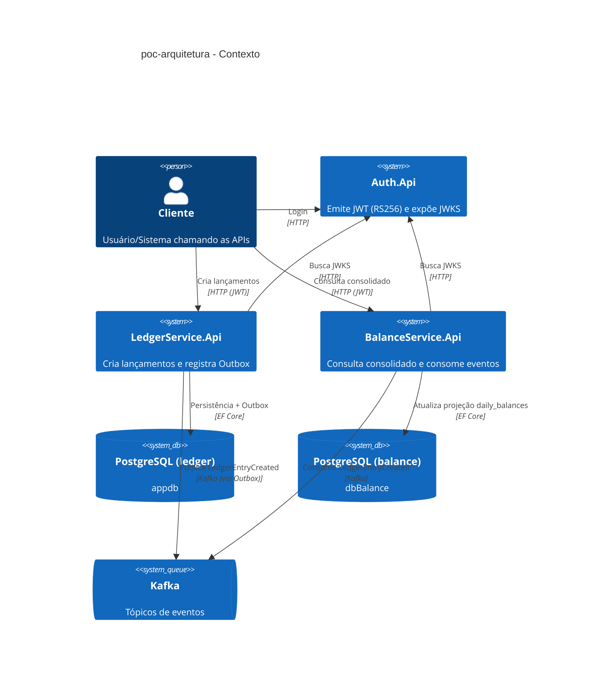

# poc-arquitetura

## 1. Visão geral do projeto

Este repositório é uma POC de **Clean Architecture** com foco em **DDD**, demonstrando:

- **LedgerService.Api**: API HTTP para criação de lançamentos (`lancamentos`).
- **BalanceService.Api**: API HTTP de leitura do consolidado (diário e por período), alimentada por eventos do Ledger.
- Persistência com **Entity Framework Core + PostgreSQL** (um banco por microserviço).
- Integração assíncrona via **Kafka**:
  - Ledger publica eventos via **Outbox** (entrega *at-least-once*).
  - Balance consome eventos e atualiza a projeção `daily_balances`.
- Base para **rastreabilidade** via *correlation id* + (opcionalmente) tracing distribuído.

## 1.1 Diagrama (Mermaid C4)



## Auth.Api (auth-api)

Este repositório também inclui o microserviço **Auth.Api** (Minimal API) com responsabilidade única de:

- Emitir **JWT (RS256)** via `POST /auth/login`
- Expor **JWKS público** via `GET /.well-known/jwks.json` para validação offline por outros serviços

### Portas

- Auth.Api: `http://localhost:5030/` (Swagger na raiz quando habilitado)

### Como executar (host)

```bash
dotnet run --project src\\Auth.Api\\Auth.Api.csproj
```

### Como executar via compose

```bash
nerdctl compose up -d --build
```

> Observação: o `compose.yaml` monta `./data/auth-api` no container para persistir a chave RSA e evitar invalidar tokens entre reinícios.

### Endpoints

#### POST /auth/login (emissão de token)

- Usuário/senha fixos (PoC):
  - `username`: `poc-usuario`
  - `password`: `Poc#123`

Request:

```json
{
  "username": "poc-usuario",
  "password": "Poc#123",
  "scope": "ledger.write balance.read"
}
```

- Scopes válidos: `ledger.write` e `balance.read`
- Se `scope` vier vazio/nulo: concede todos os scopes válidos
- Se `scope` vier com scope inválido: retorna `400` com payload padronizado

Erros padronizados:

- 401:

```json
{ "error": "invalid_credentials", "message": "Usuário ou senha inválidos." }
```

- 400 (scope inválido):

```json
{ "error": "invalid_scope", "message": "Scopes inválidos: x y. Scopes válidos: ledger.write balance.read" }
```

#### GET /.well-known/jwks.json

Retorna JWKS com a chave pública RSA atual. Inclui `Cache-Control: public, max-age=3600`.

#### GET /health

Retorna `200` com body `ok`.

> Observação: os outros microserviços também expõem `GET /health` (público) para liveness.

### Configurações (appsettings.json)

Seção `Auth`:

```json
{
  "Auth": {
    "Issuer": "https://auth-api",
    "Audiences": [ "ledger-api", "balance-api" ],
    "TokenLifetimeMinutes": 10,
    "KeyPath": "./data/keys/auth-rsa-key.json"
  }
}
```

> Importante: **não versionar segredos**. Esta PoC persiste a chave RSA em arquivo local apenas para manter tokens válidos entre reinícios.

> Importante: o endpoint **não publica diretamente no Kafka**. Ele grava o evento em `outbox_messages` (status `Pending`) e um `BackgroundService` publica em background.

## 2. Arquitetura e principais componentes

- `src/LedgerService.Api`:
  - ASP.NET Core Controllers + Swagger
  - Middlewares: `CorrelationIdMiddleware`, `GlobalExceptionHandler`, `SecurityHeadersMiddleware`
- `src/LedgerService.Application`:
  - Casos de uso/Services (ex.: `CreateLancamentoService`)
  - FluentValidation (validators de inputs)
- `src/LedgerService.Domain`:
  - Entidades e regras de domínio (`LedgerEntry`, `OutboxMessage`, etc.)
- `src/LedgerService.Infrastructure`:
  - EF Core (`AppDbContext`) + migrations
  - Outbox publisher e integração Kafka (`OutboxKafkaPublisherService`, `OutboxKafkaProducer`)
- `tests/LedgerService.Tests`:
  - Testes unitários e de repositório

### BalanceService (consolidado)

- `src/BalanceService.Api`:
  - API HTTP (somente leitura do consolidado)
  - Swagger multi-versão
  - Middlewares: `CorrelationIdMiddleware`, `GlobalExceptionHandler`, `SecurityHeadersMiddleware`
- `src/BalanceService.Application`:
  - Handlers de queries para consulta do consolidado (diário e por período)
- `src/BalanceService.Infrastructure`:
  - EF Core (`BalanceDbContext`) + migrations
  - Consumer Kafka (`LedgerEventsConsumer`) que alimenta a tabela `daily_balances`

## 3. Pré-requisitos

- .NET SDK (recomendado: **.NET 10**)
- PostgreSQL acessível localmente
- Kafka acessível localmente (caso queira validar publicação)

## 3.2 Padronização do repositório (Git + build + estilo)

Este repositório adota alguns arquivos na raiz para garantir **consistência** entre máquinas (Windows/Linux), IDEs e CI.

### `.gitattributes`

Usamos `.gitattributes` para:

- **Normalizar EOL (line endings)** por tipo de arquivo (ex.: `*.cs` com `LF`, scripts Windows com `CRLF`).
- **Reduzir ruído em diffs e PRs** (mudanças de `CRLF/LF` deixam de poluir o histórico).
- Melhorar a experiência em **Docker/CI**, onde `LF` é o padrão.

Vantagens principais:

- Menos conflitos de merge.
- Builds/testes mais previsíveis em pipelines.
- Diferenças reais de código aparecem com clareza no git.

### `Directory.Packages.props` (Central Package Management)

Usamos `Directory.Packages.props` para habilitar **Central Package Management (CPM)** e manter as versões dos pacotes NuGet em um único lugar.

Vantagens principais:

- **Atualizações de dependências mais fáceis** (um arquivo para alterar versões).
- **Menos drift** entre projetos da solução (evita cada `.csproj` ter uma versão diferente do mesmo pacote).
- `.csproj` mais enxutos (referenciam pacotes sem `Version=`).

### `Directory.Build.props`

Usamos `Directory.Build.props` para centralizar configurações MSBuild que devem valer para todos os projetos.

Exemplos do que fica nele:

- `Nullable` e `ImplicitUsings` como defaults.
- `Deterministic`/`ContinuousIntegrationBuild` para builds mais reprodutíveis.
- Documentação XML por padrão (com supressão do warning `1591` para reduzir ruído).

Vantagens principais:

- Configuração consistente em todos os projetos.
- Evita repetição em cada `.csproj`.
- Menos chance de “um projeto estar diferente” e quebrar a solução/CI.

### `.editorconfig`

Usamos `.editorconfig` para padronizar formatação e regras de estilo entre editores/IDEs.

Vantagens principais:

- **Formatação consistente** (indentação, EOL, whitespace).
- Integração com IDEs e analisadores do .NET (regras de C# como sugestão).
- Reduz diffs apenas de formatação.

## 3.1 VS Code (workspace + extensões recomendadas)

Este repositório inclui configuração para facilitar a execução no **VS Code** (com .NET 10, HTTP client e Mermaid no Markdown).

### Arquivos adicionados

- `poc-arquitetura.code-workspace`
  - define a solução padrão (`LedgerService.slnx`)
  - ajusta excludes (`bin/`, `obj/`, `.vs/`)
  - habilita Mermaid no preview de Markdown
- `.vscode/extensions.json`
  - recomenda extensões para C#/.NET, REST Client, Docker/K8s, YAML e Markdown/Mermaid
- `.vscode/settings.json`
  - configurações locais do workspace (format on save, excludes, Mermaid)
- `.vscode/launch.json` + `.vscode/tasks.json`
  - perfis de execução/debug para `LedgerService.Api` e `BalanceService.Api`
- `.vscode/rest-client.env.json`
  - variáveis por ambiente para o **REST Client** (sem segredos)

### Como abrir

No VS Code:

1. **File > Open Workspace from File...**
2. Selecione `poc-arquitetura.code-workspace`
3. Instale as extensões sugeridas quando o VS Code perguntar.

### Como chamar a API pelo VS Code

O projeto já tem um arquivo `src/LedgerService.Api/LedgerService.Api.http` (REST Client).

- Abra o arquivo `.http` e clique em **Send Request**.
- Para alternar ambientes, use a seleção de environment do REST Client.
- Variáveis ficam em `.vscode/rest-client.env.json` (ex.: `ledgerBaseUrl`, `balanceBaseUrl`).

> Importante: **não versionar segredos** nesse arquivo. Use somente URLs e valores de exemplo.

## 4. Como executar localmente (passo a passo)

### 4.0 Subir dependências e microserviços via nerdctl compose

Este repositório inclui um `compose.yaml` preparado para **nerdctl compose** (containerd), com:

- 2 bancos **PostgreSQL** (um por microserviço)
- 1 **Kafka** (single node / KRaft)
- 1 job de init para criar tópico(s) necessários
- 2 microserviços (**LedgerService.Api** e **BalanceService.Api**) na **mesma rede**

> Importante: no `BalanceService`, o consumer está com `AllowAutoCreateTopics=false`. Por isso o compose cria o tópico `ledger.ledgerentry.created` no startup.

#### Subir stack

```bash
nerdctl compose up -d --build
```

#### Parar stack

```bash
nerdctl compose down
```

#### Portas expostas (host)

- LedgerService.Api: `http://localhost:5226/`
- BalanceService.Api: `http://localhost:5228/`
- Auth.Api: `http://localhost:5030/`
- PostgreSQL Ledger: `localhost:15432` (container: `ledger-db:5432`)
- PostgreSQL Balance: `localhost:15433` (container: `balance-db:5432`)
- Kafka: `localhost:19092` (container: `kafka:9092`)

#### Observação sobre appsettings em container

Os `appsettings.json` usam `127.0.0.1` por padrão (para execução fora de container). No compose eu faço override por variáveis de ambiente:

- `ConnectionStrings__DefaultConnection`
- `Kafka__Producer__BootstrapServers`
- `Kafka__Consumer__BootstrapServers`

Assim, **dentro da rede do compose** os serviços usam `ledger-db`, `balance-db` e `kafka` como hosts.

#### Migrations (quando rodando via compose)

O compose **não aplica migrations automaticamente** (para evitar comportamento implícito em infraestrutura).

Você pode aplicar migrations a partir do host usando as portas expostas dos Postgres:

**LedgerService (AppDbContext):**

```powershell
$env:ConnectionStrings__DefaultConnection = "Host=127.0.0.1;Port=15432;Database=appdb;Username=appuser;Password=app123"
dotnet tool restore
dotnet tool run dotnet-ef -- database update `
  -p src\LedgerService.Infrastructure\LedgerService.Infrastructure.csproj `
  -s src\LedgerService.Api\LedgerService.Api.csproj `
  -c AppDbContext
```

**BalanceService (BalanceDbContext):**

```powershell
$env:ConnectionStrings__DefaultConnection = "Host=127.0.0.1;Port=15433;Database=dbBalance;Username=userBalance;Password=Balance123"
dotnet tool restore
dotnet tool run dotnet-ef -- database update `
  -p src\BalanceService.Infrastructure\BalanceService.Infrastructure.csproj `
  -s src\BalanceService.Api\BalanceService.Api.csproj `
  -c BalanceDbContext
```

> TODO: se quiser automatizar migrations no startup do compose, criar um job/sidecar explícito para isso.

#### Como validar rapidamente

```bash
# Ver status dos containers
nerdctl compose ps

# Ver logs (exemplo)
nerdctl compose logs -f ledger-service
```

## 4.7 Load tests (k6) via compose network

Os testes de carga ficam em `./loadtests/k6` e rodam **dentro da rede do compose** (ou seja, acessam as APIs por `http://<service_name>:<internal_port>` e **não** por `localhost`).

### Pré-requisitos

1) Suba a stack:

```bash
nerdctl compose -f compose.yaml up -d --build
```

2) (Opcional) aplique migrations, se necessário (ver seção 4.0).

### Execução reprodutível

Os runners fazem:

1. Gerar `.env.k6.auto` a partir do `compose.yaml` (script `scripts/compose-env.*`)
2. Obter `TOKEN` conforme README (script `scripts/get-token.*`)
3. Rodar `k6` via `nerdctl compose` (compose override `compose.k6.yaml`)
4. Exportar summary JSON em `./artifacts/k6`

#### Windows (PowerShell)

```powershell
./scripts/run-loadtests.ps1 -Mode smoke
./scripts/run-loadtests.ps1 -Mode balance50
./scripts/run-loadtests.ps1 -Mode resilience
```

#### Linux/Mac (bash)

```bash
chmod +x ./scripts/*.sh
./scripts/run-loadtests.sh smoke
./scripts/run-loadtests.sh balance50
./scripts/run-loadtests.sh resilience
```

### Overrides via variáveis de ambiente

- `AUTH_BASE_URL`, `TOKEN_URL`, `USERNAME`, `PASSWORD`, `SCOPE`
  - usados por `scripts/get-token.*`
- `TOKEN`
  - se você já tiver o JWT, pode pular o get-token e rodar k6 manualmente com `-e TOKEN=...`.
- `ALLOW_ANON=true`
  - permite rodar os scripts k6 sem token (útil para debug), mas os endpoints de negócio provavelmente vão retornar 401.

### Critérios de “passar”

- `balance_daily_50rps`:
  - `http_req_failed <= 0.05`
  - `dropped_iterations == 0`
- `ledger_resilience` (com Balance parado):
  - manter respostas `2xx/201` no Ledger

> Observação: `./artifacts/k6` e `.env.k6.auto` são gerados localmente e **não** são versionados.

### 4.1 Restaurar tools locais

O repositório versiona o `dotnet-ef` via `dotnet-tools.json`.

```bash
dotnet tool restore
```

### 4.2 Configurar variáveis de ambiente / appsettings

Configurações ficam em:

- `src/LedgerService.Api/appsettings.json`
- `src/LedgerService.Api/appsettings.Development.json`

**Não coloque segredos no repositório.** Para execução local, use variáveis de ambiente.

Exemplos (Windows PowerShell):

```powershell
$env:ConnectionStrings__DefaultConnection = "Host=127.0.0.1;Port=5432;Database=appdb;Username=appuser;Password=__REDACTED__"
$env:Kafka__Producer__BootstrapServers = "127.0.0.1:9092"
```

> Observação: o formato `__` representa o separador de seções do .NET Configuration.

### 4.3 Aplicar migrations

As migrations ficam no projeto `LedgerService.Infrastructure` (onde está o `AppDbContext`).

```bash
dotnet tool run dotnet-ef -- database update \
  -p src\\LedgerService.Infrastructure\\LedgerService.Infrastructure.csproj \
  -s src\\LedgerService.Api\\LedgerService.Api.csproj \
  -c AppDbContext \
  -- --environment Development
```

> O `-- --environment Development` é repassado para a aplicação (startup project) para ela carregar `appsettings.Development.json`.

### 4.4 Subir a API

```bash
dotnet run --project src\\LedgerService.Api\\LedgerService.Api.csproj
```

 - Swagger UI: `http://localhost:5226/`
- OpenAPI JSON:
  - `http://localhost:5226/swagger/v1/swagger.json`

### 4.4.1 Subir o BalanceService.Api

```bash
dotnet run --project src\\BalanceService.Api\\BalanceService.Api.csproj
```

- Swagger UI: `http://localhost:5228/`
- OpenAPI JSON:
  - `http://localhost:5228/swagger/v1/swagger.json`

#### Rotas de consulta (BalanceService)

- `GET /v1/consolidados/diario/{date}?merchantId={merchantId}`
- `GET /v1/consolidados/periodo?from=YYYY-MM-DD&to=YYYY-MM-DD&merchantId={merchantId}`

> Observação: padrão adotado quando não há dados é **200 com zeros** (documentado no Swagger).

## 4.6 Autenticação e autorização (JWT Bearer via JWKS)

Os serviços **LedgerService.Api** e **BalanceService.Api** exigem **JWT Bearer** por padrão nas rotas de negócio.

- Validação de assinatura: **RS256** com chaves obtidas do **JWKS do Auth.Api** (`GET /.well-known/jwks.json`).
- Sem introspecção: as APIs **não chamam o Auth.Api por request**; a configuração de chaves é feita via `ConfigurationManager` (cache com refresh).
- Claim de scopes: **`scope`** (string com scopes separados por espaço). **Não** usamos `scp`.
- Validação estrita:
  - `iss` deve bater com o `Jwt:Issuer` configurado.
  - `aud` deve conter a audience do serviço:
    - LedgerService.Api: `ledger-api`
    - BalanceService.Api: `balance-api`
  - Observação: nesta PoC, o Auth.Api emite `aud` como **uma string** com audiences separadas por espaço (ex.: `"ledger-api balance-api"`). As APIs tratam isso tokenizando por espaço.

### Como obter token (Auth.Api)

1) Suba o `Auth.Api` (via compose ou `dotnet run`).
2) Solicite um token:

```bash
curl -s -X POST http://localhost:5030/auth/login \
  -H "Content-Type: application/json" \
  -d '{
    "username": "poc-usuario",
    "password": "Poc#123",
    "scope": "ledger.write balance.read"
  }'
```

3) Copie `accessToken` do response e use nas chamadas:

```bash
curl -i http://localhost:5226/api/v1/lancamentos \
  -H "Authorization: Bearer <TOKEN>" \
  -H "Idempotency-Key: 00000000-0000-0000-0000-000000000001" \
  -H "Content-Type: application/json" \
  -d '{"type":"CREDIT","merchantId":"tese","amount":"10.00","currency":"BRL"}'
```

### Scopes por endpoint

- LedgerService.Api
  - `POST /api/v1/lancamentos`: requer `ledger.write`
- BalanceService.Api
  - `GET /v1/consolidados/diario/{date}`: requer `balance.read`
  - `GET /v1/consolidados/periodo`: requer `balance.read`

## 4.5 Versionamento da API

Esta API usa **Asp.Versioning** com estratégia de **URL segment**.

- Formato: `api/v{version}/...`
- Versão padrão: `v1` (quando a versão não for especificada explicitamente)
- O Swagger UI lista automaticamente todas as versões disponíveis.

Exemplo:

- `POST /api/v1/lancamentos`

## 5. Como rodar testes

```bash
dotnet test
```

### 5.1 Rodando todos os testes com gate de coverage (>= 85% line)

Windows (PowerShell):

```powershell
./test.ps1
```

Linux/Mac:

```bash
chmod +x ./test.sh
./test.sh
```

O gate é aplicado via **coverlet** (MSBuild properties) e falha o comando caso a cobertura global da solução fique abaixo do threshold.

Exclusões aplicadas (com parcimônia, sem “forçar” coverage):

- `Program.cs` (minimal hosting)
- migrations EF (`*/Migrations/*.cs`)
- arquivos gerados (`*.g.cs`)

Os resultados ficam em `./TestResults/` (ignorado no git).

> Nota: internamente os scripts passam as exclusões via `/p:ExcludeByFile` (lista separada por vírgula).

## 6. Banco de dados e migrations

### 6.1 Listar migrations

```bash
dotnet tool run dotnet-ef -- migrations list \
  -p src\\LedgerService.Infrastructure\\LedgerService.Infrastructure.csproj \
  -s src\\LedgerService.Api\\LedgerService.Api.csproj \
  -c AppDbContext
```

### 6.2 Criar nova migration

```bash
dotnet tool run dotnet-ef -- migrations add NomeDaMigration \
  -p src\\LedgerService.Infrastructure\\LedgerService.Infrastructure.csproj \
  -s src\\LedgerService.Api\\LedgerService.Api.csproj \
  -c AppDbContext \
  -o Persistence\\Migrations
```

### 6.3 Aplicar migration

```bash
dotnet tool run dotnet-ef -- database update \
  -p src\\LedgerService.Infrastructure\\LedgerService.Infrastructure.csproj \
  -s src\\LedgerService.Api\\LedgerService.Api.csproj \
  -c AppDbContext \
  -- --environment Development
```

### 6.4 Reverter migration (quando aplicável)

O EF Core permite voltar para uma migration específica (inclusive `0`).

```bash
dotnet tool run dotnet-ef -- database update NomeDaMigrationAnteriorOu0 \
  -p src\\LedgerService.Infrastructure\\LedgerService.Infrastructure.csproj \
  -s src\\LedgerService.Api\\LedgerService.Api.csproj \
  -c AppDbContext \
  -- --environment Development
```

## 7. Kafka (se aplicável)

### 7.1 Onde ficam as configurações

- Producer: `Kafka:Producer` (`src/LedgerService.Api/appsettings.json`)
- Outbox publisher: `Outbox:Publisher` (`src/LedgerService.Api/appsettings.json`)

**Exemplo (sem segredos):**

```json
{
  "Kafka": {
    "Producer": {
      "BootstrapServers": "127.0.0.1:9092",
      "ClientId": "ledger-service",
      "Acks": "all",
      "EnableIdempotence": true,
      "DefaultTopic": "ledger-events",
      "TopicMap": {
        "LedgerEntryCreated": "ledger.ledgerentry.created"
      }
    }
  },
  "Outbox": {
    "Publisher": {
      "PollingIntervalSeconds": 5,
      "BatchSize": 50,
      "MaxParallelism": 4,
      "MaxAttempts": 10,
      "BaseBackoffSeconds": 5,
      "LockDurationSeconds": 60
    }
  }
}
```

### 7.2 Tópicos publicados

- Evento: `LedgerEntryCreated`
- Tópico (por padrão): `ledger-events`
- Mapeamento atual em `TopicMap`: `LedgerEntryCreated` -> `ledger.ledgerentry.created`

### 7.3 Headers publicados

Ao publicar, o producer inclui headers:

- `event_id`
- `event_type`
- `correlation_id` (quando existir)

> Observação: a propagação de headers W3C (`traceparent`, `baggage`) depende da configuração de observabilidade (ver seção 8 e `docs/observability.md`).

### 7.4 Como validar (PENDING -> SENT)

1. Aplicar migrations no PostgreSQL.
2. Subir a API.
3. Criar um lançamento via `POST /api/v1/lancamentos`.
4. Verificar no banco:
   - ao criar, surge uma linha em `outbox_messages` com `status = 'Pending'`
   - após alguns segundos, o publisher marca como `status = 'Sent'` (após confirmação do publish no Kafka)

Em caso de falha no Kafka, o serviço não cai: ele registra erro, incrementa tentativas e agenda `next_attempt_at` com backoff.

## 8. Observabilidade e rastreabilidade

### 8.1 Correlação (estado atual)

- A API usa o header `X-Correlation-Id`:
  - se ausente/inválido, gera um novo UUID;
  - retorna o mesmo header no response;
  - adiciona `CorrelationId` nos logs via logging scope.

### 8.2 Traces e métricas

Consulte `docs/observability.md` para:

- arquitetura de telemetria;
- campos de correlação adotados (`CorrelationId`, `traceId/spanId`);
- como validar localmente.

> TODO: documento será criado/atualizado na etapa de observabilidade.

## 9. Troubleshooting básico

- **Erro ao aplicar migrations**: confirme a connection string e se o PostgreSQL está acessível.
- **Swagger não abre**: confirme que a aplicação está rodando e acessível na URL configurada (`launchSettings.json`).
- **Outbox publisher logando queries repetidas**: comportamento esperado (polling). Ajuste `Outbox:Publisher:PollingIntervalSeconds`.

## 10. Limitações conhecidas

- Implementação de autenticação/autorização via JWT Bearer foi adicionada, porém a política de scopes do Auth.Api ainda é simplificada para a PoC.
- TODO: detalhar estratégia de readiness (ex.: verificar DB/Kafka) se necessário. Atualmente `/health` é um liveness simples.
