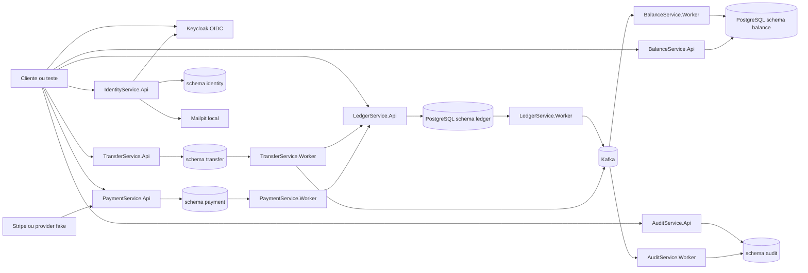

# poc-arquitetura

[](https://github.com/rodri-oliveira-dev/poc-arquitetura/actions/workflows/dotnet.yml)
[](https://github.com/rodri-oliveira-dev/poc-arquitetura/actions/workflows/dotnet.yml)
[](https://sonarcloud.io/summary/new_code?id=rodri-oliveira-dev_poc-arquitetura)
[](https://sonarcloud.io/summary/new_code?id=rodri-oliveira-dev_poc-arquitetura)
[](https://rodri-oliveira-dev.github.io/poc-arquitetura/)

POC educacional de microserviços em .NET para estudar arquitetura de software com código real: Clean Architecture, DDD, PostgreSQL, Kafka, Outbox, Inbox, JWT/JWKS com Keycloak, observabilidade, segurança, contratos e testes automatizados.

Ela demonstra um problema comum em sistemas financeiros: registrar fatos de forma transacional, publicar eventos com confiabilidade, projetar saldos em outro serviço e operar falhas sem esconder consistência eventual. O repositório também mostra contextos de identidade, transferência, pagamento externo e auditoria funcional para exercitar trade-offs de integração.

Este projeto é útil para:

- quem está aprendendo arquitetura e quer ver os conceitos aplicados;
- desenvolvedores .NET que querem executar, testar e alterar uma stack local;
- arquitetos que querem avaliar decisões, limites e riscos;
- avaliadores técnicos que querem entender a proposta rapidamente.

## Visão geral


```mermaid
flowchart LR
    Client[Cliente ou teste] --> Keycloak[Keycloak OIDC]
    Client --> LedgerApi[LedgerService.Api]
    Client --> BalanceApi[BalanceService.Api]
    Client --> TransferApi[TransferService.Api]
    Client --> PaymentApi[PaymentService.Api]
    Client --> IdentityApi[IdentityService.Api]
    Client --> AuditApi[AuditService.Api]

    LedgerApi --> LedgerDb[(PostgreSQL schema ledger)]
    LedgerDb --> LedgerWorker[LedgerService.Worker]
    LedgerWorker --> Kafka[(Kafka)]
    Kafka --> BalanceWorker[BalanceService.Worker]
    BalanceWorker --> BalanceDb[(PostgreSQL schema balance)]
    BalanceApi --> BalanceDb

    TransferApi --> TransferDb[(schema transfer)]
    TransferWorker[TransferService.Worker] --> LedgerApi
    TransferDb --> TransferWorker
    TransferWorker --> Kafka

    PaymentApi --> PaymentDb[(schema payment)]
    Stripe[Stripe ou provider fake] --> PaymentApi
    PaymentDb --> PaymentWorker[PaymentService.Worker]
    PaymentWorker --> LedgerApi

    IdentityApi --> IdentityDb[(schema identity)]
    IdentityApi --> Keycloak
    IdentityApi --> Mailpit[Mailpit local]

    Kafka --> AuditWorker[AuditService.Worker]
    AuditApi --> AuditDb[(schema audit)]
    AuditWorker --> AuditDb
```

No modo local padrão, Kafka é o transporte principal dos workers de Ledger, Balance, Transfer e Audit. Pub/Sub permanece como alternativa explícita/legada apenas para Ledger/Balance. O `PaymentService` não publica eventos financeiros diretamente: depois de confirmar um pagamento, o worker chama o `LedgerService.Api`, e o Balance continua sendo atualizado pelos eventos do Ledger.

## O que você aprende

- Como separar escrita (`Ledger`) e leitura (`Balance`) sem perder rastreabilidade.
- Por que Outbox ajuda quando banco e broker precisam andar juntos sem transação distribuída.
- Como Inbox deduplica webhooks externos antes do processamento assíncrono.
- Como idempotência protege retries HTTP, webhooks e consumidores.
- Como uma Saga orquestrada coordena transferência entre merchants.
- Como JWT/JWKS, scopes e autorização por merchant aparecem nas APIs.
- Como health, readiness, logs, traces, métricas, DLQ e replay entram na operação.
- Como ADRs, specs SDD, contratos e runbooks sustentam decisões ao longo do tempo.

## Bounded contexts

| Contexto | Papel no laboratório |
| --- | --- |
| `LedgerService` | Fonte de verdade dos fatos financeiros, Outbox, estornos e reprocessamentos. |
| `BalanceService` | Projeção de saldo consumindo eventos do Ledger. |
| `TransferService` | Saga de transferência entre merchants, Kafka-only. |
| `PaymentService` | Pagamentos externos, ACL Stripe/fake provider, webhook assinado, Inbox e materialização no Ledger. |
| `IdentityService` | Cadastro de usuários, vínculo local, `MerchantId`, Keycloak Admin API e e-mail local. |
| `AuditService` | Auditoria funcional por HTTP e consumer Kafka de `AuditRecordRequested.v1`; os demais domínios ainda não publicam eventos reais de auditoria. |
| `Auth.Api` | Legado preservado no repositório para rastreabilidade histórica; Keycloak é o emissor principal da stack local. |

Os serviços seguem a separação `Api`, `Application`, `Domain`, `Infrastructure` e, quando aplicável, `Worker`. A explicação das fronteiras fica em [docs/architecture/boundaries.md](docs/architecture/boundaries.md).

## Quickstart

Pré-requisitos: .NET SDK conforme [global.json](global.json), CLI `docker` com `docker compose` e uma Docker-compatible API acessível.

Valide build e testes:

```powershell
dotnet tool restore
dotnet restore ./PocArquitetura.slnx
dotnet build ./PocArquitetura.slnx --configuration Release --no-restore
dotnet test ./PocArquitetura.slnx --configuration Release --no-build --settings ./coverlet.runsettings
```

Suba o core funcional local no Windows:

```powershell
./scripts/local/create-env-local.ps1
./scripts/local/start-stack.ps1
```

No Linux/macOS:

```bash
./scripts/local/create-env-local.sh
./scripts/local/start-stack.sh
```

O script sobe PostgreSQL, Kafka, Keycloak, Mailpit, APIs e workers principais, aplica migrations pelo host e preserva volumes. O passo a passo completo, portas, debug, Testcontainers, observabilidade e limpeza ficam em [desenvolvimento local](docs/development/local-development.md).

Para incluir observabilidade local completa:

```powershell
./scripts/local/start-stack.ps1 -Observability
```

No Linux/macOS:

```bash
OBSERVABILITY=true ./scripts/local/start-stack.sh
```

## Exemplos de fluxo

**Lançamento financeiro**

1. `LedgerService.Api` recebe o comando HTTP.
2. Ledger grava o fato e a mensagem de Outbox na mesma transação.
3. `LedgerService.Worker` publica no Kafka.
4. `BalanceService.Worker` consome, aplica idempotência e atualiza a projeção.
5. `BalanceService.Api` consulta o saldo materializado.

**Pagamento externo**

1. `PaymentService.Api` cria o pagamento no provider fake ou Stripe por uma ACL.
2. Webhooks Stripe entram por endpoint assinado e são persistidos na Inbox.
3. `PaymentService.Worker` processa a Inbox com retry e lease.
4. Pagamentos confirmados viram lançamentos no Ledger por chamada HTTP idempotente.

**Transferência**

1. `TransferService.Api` registra a Saga.
2. `TransferService.Worker` chama Ledger para débito e crédito.
3. Falha após débito dispara compensação por estorno no Ledger.
4. Eventos da Saga são publicados no Kafka para rastreabilidade operacional.

## Jornada de leitura

| Jornada | Ordem recomendada |
| --- | --- |
| Rápida, 10 a 15 min | Este README -> [FAQ](docs/faq.md) -> [Maturidade](docs/maturity.md) -> [Arquitetura](docs/architecture/README.md) |
| Iniciante | Este README -> [docs/README.md](docs/README.md) -> [Boundaries](docs/architecture/boundaries.md) -> [Catálogo de padrões](docs/architecture/patterns-catalog.md) -> [Mensageria, Outbox e DLQ](docs/development/kafka-outbox.md) |
| Desenvolvedor | [Desenvolvimento local](docs/development/local-development.md) -> [Autenticação](docs/development/authentication.md) -> guias de API em `docs/development/*-api.md` -> [Testes e cobertura](docs/development/test-coverage.md) |
| Arquitetural | [Arquitetura](docs/architecture/README.md): `systemLandscape` -> container view -> component view -> dynamic view -> `localCoreDeployment` -> overlay quando necessário -> [ADRs](docs/adrs/README.md) |
| Operacional | [Observabilidade](docs/observability.md) -> [Runbook de recuperação](docs/operations/event-recovery-runbook.md) -> [DLQ](docs/operations/dlq-strategy.md) -> [Replay](docs/operations/replay-strategy.md) |

O índice completo fica em [docs/README.md](docs/README.md). A documentação visual LikeC4 publicada fica em <https://rodri-oliveira-dev.github.io/poc-arquitetura/>.

## Documentos principais

- [Arquitetura](docs/architecture/README.md)
- [Catálogo de padrões](docs/architecture/patterns-catalog.md)
- [Desenvolvimento local](docs/development/local-development.md)
- [Autenticação e autorização](docs/development/authentication.md)
- [Mensageria, Outbox e DLQ](docs/development/kafka-outbox.md)
- [Eventos](docs/events/README.md)
- [Contratos OpenAPI](docs/openapi)
- [Observabilidade](docs/observability.md)
- [Runbooks operacionais](docs/operations/event-recovery-runbook.md)
- [ADRs](docs/adrs/README.md)
- [Specs SDD](docs/specs)
- [Maturidade](docs/maturity.md)
- [Roadmap](docs/roadmap.md)

## Limites da POC

Esta POC não deve ser lida como pronta para produção. Ela é um laboratório local, com várias decisões deliberadamente proporcionais ao estudo:

- secrets locais ficam fora do Git, mas não há secret store produtivo;
- Kafka local é o caminho padrão; Pub/Sub e legado/opt-in para Ledger/Balance;
- rate limiting é local a cada réplica;
- Nginx, observabilidade, SonarQube e k6 são overlays opcionais;
- não há redrive público versionado para todas as DLQs;
- `AuditService.Worker` consome o contrato canônico, mas os demais domínios ainda não produzem auditoria funcional real;
- `IdentityService` cria usuários no Keycloak e compensa falhas conhecidas, mas envio de e-mail ainda não usa Outbox durável;
- referências ao `Auth.Api` são históricas ou de compatibilidade; Keycloak é a identidade principal.

Para avaliar evolução produtiva, leia [baseline de evolução produtiva](docs/architecture/production-readiness.md).

## Comandos úteis

| Tarefa | Comando |
| --- | --- |
| Testes com cobertura e gate | `./test.ps1` ou `./test.sh` |
| Stack local padrão | `./scripts/local/start-stack.ps1` ou `./scripts/local/start-stack.sh` |
| Stack completa com Nginx | `./scripts/local/start-full-stack.ps1` ou `./scripts/local/start-full-stack.sh` |
| Pub/Sub legado | `./scripts/local/start-stack-pubsub.ps1` ou `./scripts/local/start-stack-pubsub.sh` |
| Gerar OpenAPI | `./scripts/contracts/openapi/generate.ps1` ou `./scripts/contracts/openapi/generate.sh` |
| Validar eventos | `npm run events:validate` |
| Gerar LikeC4 | `npm run architecture:build` |
| Load test smoke Kafka | `./scripts/performance/run-loadtests.ps1 -Mode smoke-kafka` ou `./scripts/performance/run-loadtests.sh smoke-kafka` |

## Contribuição e segurança

Leia [CONTRIBUTING.md](CONTRIBUTING.md), [SECURITY.md](SECURITY.md) e [AGENTS.md](AGENTS.md) antes de propor mudanças. Mudancas em contratos HTTP exigem regenerar `docs/openapi`; mudanças arquiteturais relevantes devem atualizar a documentação correspondente e, quando houver decisão nova, registrar ADR.
