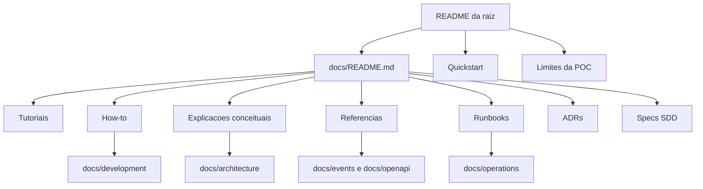

# Revisao da experiencia de documentacao - design

## Estrategia

A documentacao sera tratada como um sistema de conhecimento com quatro camadas:

1. **Entrada**: README da raiz, curto e orientado a decisao de leitura.
2. **Mapa**: `docs/README.md`, organizado por jornada, taxonomia e area.
3. **Guias atuais**: arquitetura, desenvolvimento, operacao, seguranca, qualidade, eventos e APIs.
4. **Historico**: ADRs, specs SDD e relatorios, mantidos rastreaveis sem competir com a leitura principal.

## Decisoes editoriais

- O README nao deve repetir detalhes extensos de cada servico. Ele apresenta a proposta, os fluxos e aponta para fontes especializadas.
- O indice documental deve responder "o que leio agora?", nao apenas listar arquivos.
- ADRs devem preservar linguagem historica quando ela descreve o estado da epoca. A atualizacao principal fica no indice e nos documentos atuais.
- Specs SDD devem ser expostas como historico de mudancas, nao como documentacao principal para onboarding.
- Runbooks devem ser conectados a sintomas e decisoes operacionais.

## Modelo de navegacao

## Regras de consolidacao

- Conteudo repetido no README deve virar link para documento especializado.
- Conceito avancado citado pela primeira vez deve ter uma explicacao curta ou link claro.
- Documentos de referencia podem ser densos; documentos de entrada devem ser progressivos.
- Quando um documento estiver correto mas longo, preferir melhorar navegacao antes de dividir.
- Quando uma informacao estiver historica, marcar como historica em vez de apagar.

## Inventario

O inventario usa leitura automatizada dos Markdown com extracao de:

- H1;
- contagem aproximada de palavras;
- links relativos enviados;
- agrupamento por pasta;
- busca textual por termos tecnicos e referencias possivelmente antigas.

O relatorio final consolida o inventario por categoria e lista acoes recomendadas para cada grupo documental, com exemplos de documentos de maior risco.

## Validacao

Validacoes planejadas:

- `git diff --check`;
- busca por referencias antigas;
- validacao de links relativos Markdown por script local;
- `npm run architecture:build`;
- `npm run events:validate`;
- `npm run openapi:lint`;
- `./scripts/quality/validate-adrs.ps1`;
- build/testes .NET somente se alteracoes ultrapassarem documentacao.

Como esta revisao nao altera contratos HTTP, a geracao OpenAPI nao e obrigatoria.
