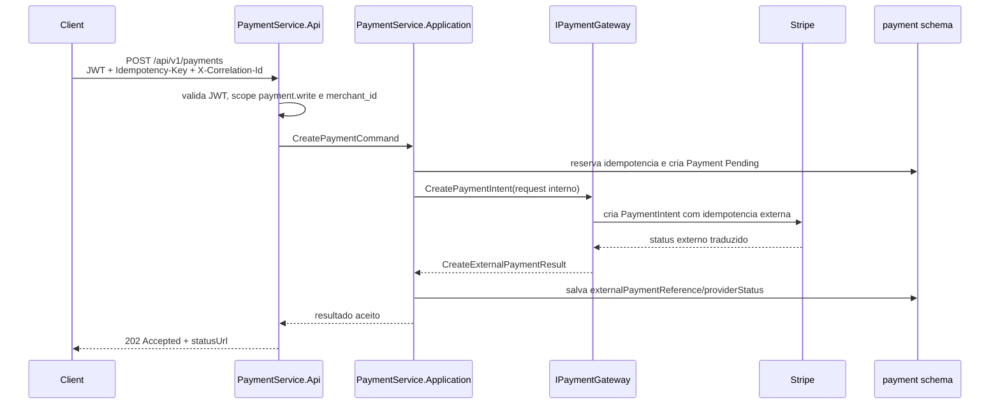
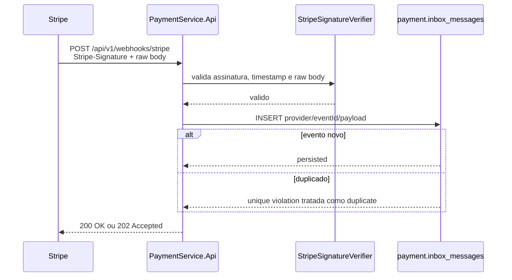
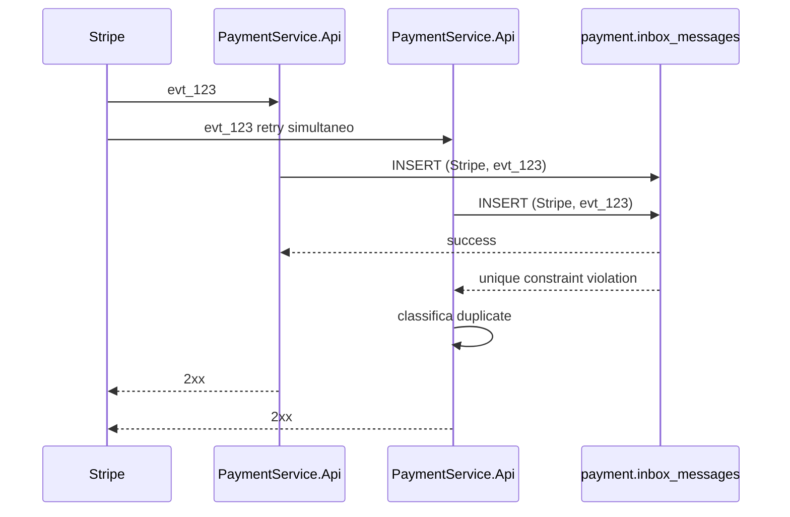
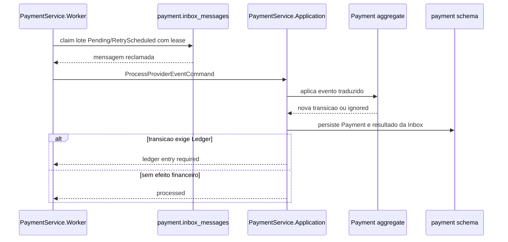
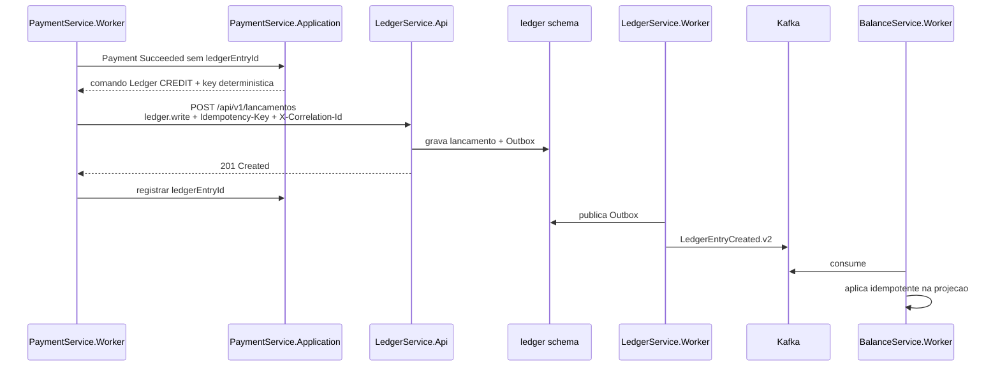
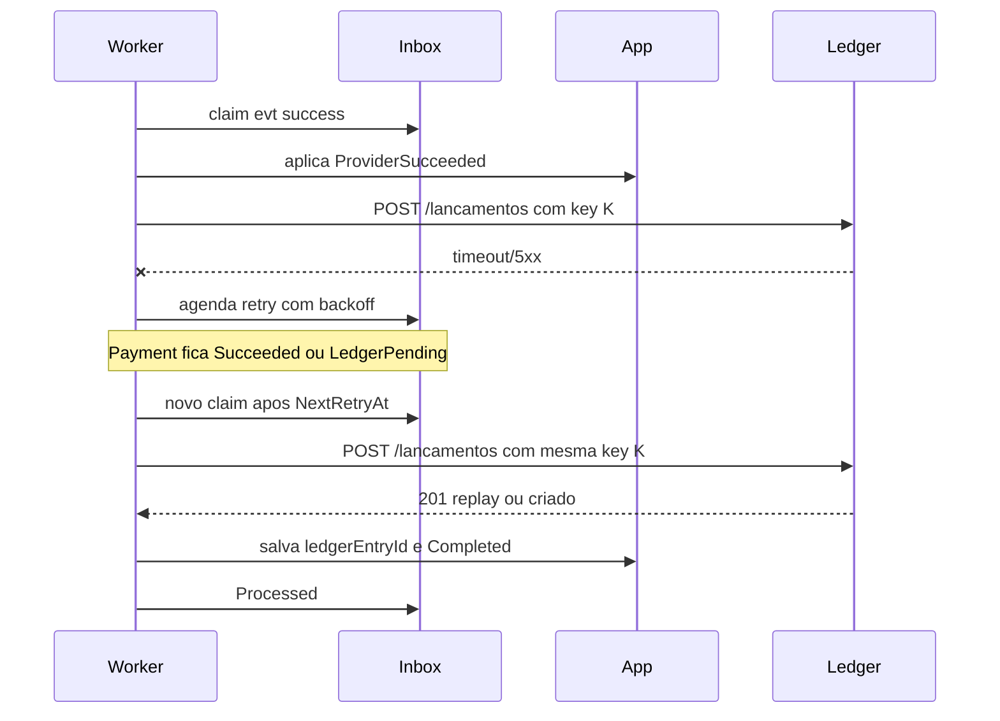
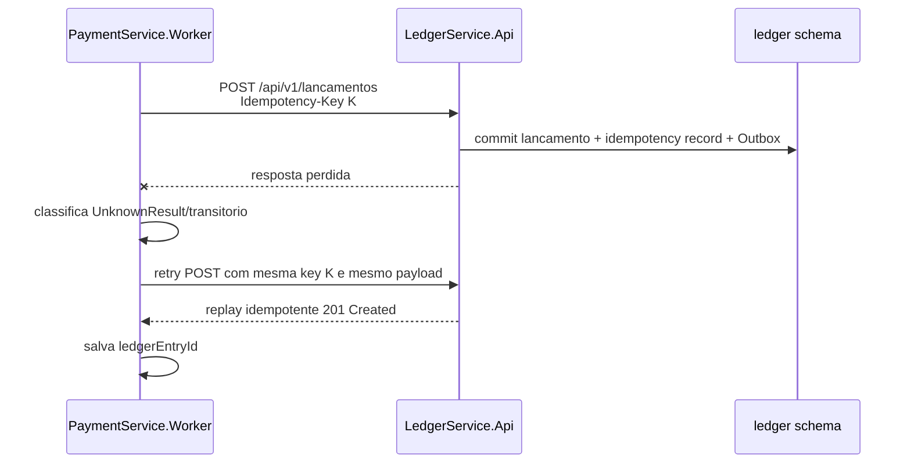
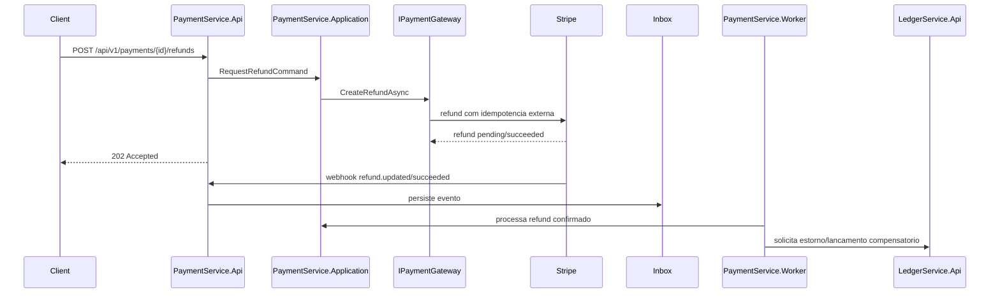

# Specification SDD: PaymentService integrado a Stripe - fluxos

## Criacao de pagamento

Decisoes:

- A resposta nao promete efeito financeiro.
- `Idempotency-Key` do cliente controla replay de `POST /payments`.
- A key externa enviada a Stripe deve ser deterministica e derivada do
  `paymentId` ou da idempotencia interna.

## Webhook

Decisoes:

- JWT nao se aplica ao webhook.
- Assinatura invalida nao persiste Inbox.
- Sucesso ao provider ocorre apos persistencia, nao apos processamento completo.

## Deduplicacao

Resultado: apenas uma linha fica elegivel para o Worker. Mesmo que a duplicidade
passe por falha futura, a state machine e o Ledger idempotente evitam segundo
credito.

## Processamento da Inbox

Regras:

- Claim deve ser atomico.
- Lease expirado permite retry por outra instancia.
- Eventos regressivos conhecidos podem ser `Processed/Ignored`.
- Poison messages vao para dead-letter logico.

## Integracao com Ledger

Boundaries:

- PaymentService usa HTTP publico/autenticado do Ledger.
- PaymentService nao grava no schema `ledger`.
- BalanceService recebe apenas eventos do Ledger.

## Falha e retry

Regras:

- Retry de `POST` ao Ledger so e permitido porque a key e deterministica.
- 4xx definitivos nao entram em retry infinito.
- 429 respeita backoff e possivel `Retry-After`.

## Timeout desconhecido no Ledger

Garantia: se o Ledger persistiu a primeira chamada, o retry com mesma key e
mesmo payload nao cria segundo lancamento. Se o payload mudou, o `409 Conflict`
indica bug ou corrupcao de determinismo e deve parar o fluxo automatico.

## Futuro refund

Fora de escopo agora:

- Endpoint real de refund.
- Tabelas de refund.
- Eventos de refund.
- Estorno automatico no Ledger.
